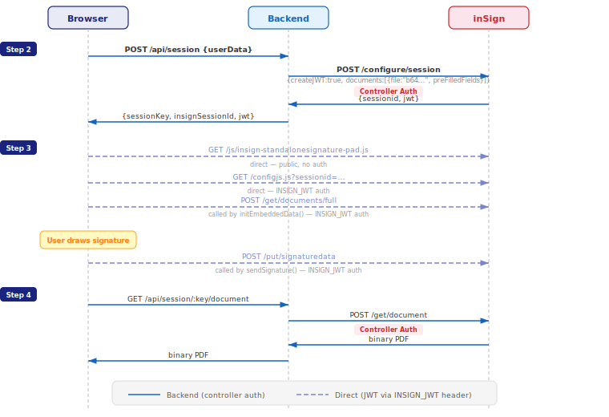

<p align="center">
  <a href="https://www.getinsign.com/">
    
  </a>
</p>

<h1 align="center">inSign API - Getting Started</h1>

<p align="center">
  <strong>Integrate electronic signatures into your application in minutes.</strong><br>
  <sub>Free sandbox. No registration. No credit card. Just code.</sub>
</p>

<p align="center">
  <a href="https://github.com/tombueng/insign-getting-started-1/actions/workflows/maven.yml">
    
  </a>
  <a href="https://github.com/tombueng/insign-getting-started-1/actions/workflows/node.yml">
    
  </a>
</p>

---

This repository contains everything you need to get started with the **inSign** electronic signature API: an interactive getting-started guide, a browser-based API explorer, a Java/Spring Boot sample application, and a Node.js demo showing the embedded signature widget.

## Links

| | |
|---|---|
| **Getting Started Guide** | [Start here](https://tombueng.github.io/insign-getting-started-1/) |
| **API Explorer** | [Open the interactive API Explorer](https://tombueng.github.io/insign-getting-started-1/explorer.html) |
| **Swagger API Reference** | [Browse the API docs](https://sandbox.test.getinsign.show/docs/swagger-ui/index.html) |
| **inSign Homepage** | [www.getinsign.com](https://www.getinsign.com/) |

---

## Start Here - The Getting Started Guide

> **[https://tombueng.github.io/insign-getting-started-1/](https://tombueng.github.io/insign-getting-started-1/)**

The Getting Started Guide is a single-page interactive walkthrough hosted via GitHub Pages (served from the [`docs/`](docs/) directory). It is the best starting point for anyone new to the inSign API.

The guide walks you through the core signing workflow step by step: creating a session, uploading a document, opening the signing UI, and retrieving the signed result. Each step includes live code examples with a built-in JSON editor, pre-configured to work against the inSign sandbox - you can execute real API calls directly from the page without any setup.

The guide links to the full API Explorer for deeper exploration and to the Swagger API reference for the complete endpoint documentation.

---

## API Explorer

> **[https://tombueng.github.io/insign-getting-started-1/explorer.html](https://tombueng.github.io/insign-getting-started-1/explorer.html)**

The API Explorer is a full interactive playground for the inSign API, also hosted via GitHub Pages from [`docs/explorer.html`](docs/explorer.html). It runs entirely in the browser - no backend required.

It provides a four-step guided flow that covers the complete signing lifecycle:

1. **Create Session** - configure and create an inSign session with live request/response editing
2. **Upload Document** - upload a PDF to the session (via URL, Base64, or file upload)
3. **Sign** - open the inSign signing UI in an embedded iframe or external window
4. **Download** - retrieve the signed document and inspect session status

Each step includes editable JSON request bodies, real-time response display, and credential management (with profiles that can be saved to localStorage). The explorer connects to the inSign sandbox by default and works out of the box.

---

## Sig-Funnel - Embedded Signature Pad Demo

The [`src/sign-widget-demo-application/`](src/sign-widget-demo-application/) directory contains a **self-contained Node.js demo** (based on [sig-funnel](https://github.com/tombueng/insign-getting-started-1)) that demonstrates the inSign **embedded signature pad** in a realistic use case: a SEPA Direct Debit Mandate signing flow.

The user fills in personal data, the server generates a mandate PDF on the fly, creates an inSign session, and the signature pad is rendered inline - all without leaving the page. Each step includes collapsible developer documentation explaining the integration.

### Quick Start

```bash
cd src/sign-widget-demo-application
npm install
npm start             # or: npm run dev (auto-reload)
# Open http://localhost:3000
```

Connects to the inSign sandbox by default. No registration needed. The form is prefilled with test data so you can click through the entire flow immediately.

Also deployable to Glitch, StackBlitz, Vercel, or Docker - see the [Sig-Funnel README](src/sign-widget-demo-application/README.md) for all options.

### What It Demonstrates

- **No proxy needed** - the browser talks directly to the inSign server; the embedded API is fully cookieless
- JWT-based authentication for embedded mode (`createJWT: true`, `INSIGN_JWT` custom header)
- Controller credentials stay server-side - the browser only receives a session-scoped JWT
- Using `##SIG{...}` tags in a generated PDF for automatic signature field placement
- Single API call session creation with PDF + `preFilledFields`
- Dynamically rendering signature pads for each signature field found in the PDF
- Downloading the signed PDF with embedded biometric data

### Architecture

The core business logic lives in shared modules (`src/routes.js`, `src/insign-client.js`, `src/pdf-generator.js`) with thin wrappers for Express (local/Docker) and Vercel (serverless). No code duplication across platforms.

<p align="center">
  
</p>

See the [Sig-Funnel README](src/sign-widget-demo-application/README.md) for the full documentation, including step-by-step guides, architecture diagrams, mobile WebView integration, security considerations, and a production checklist.

---

## Java Sample Application

The [`src/java/`](src/java/) directory contains a **Spring Boot sample application** that demonstrates the full inSign signing workflow: session creation, document upload, external signing invitations, real-time status tracking, webhook handling, and document download.

It uses a **pluggable API client architecture** - choose between two included implementations or write your own by implementing a single interface.

### Quick Start

```bash
cd src/java
mvn spring-boot:run
# Open http://localhost:8090
```

Connects to the inSign sandbox by default. No registration needed.

### Key Features

- **Pluggable API client** - swap implementations by changing one Maven dependency
- **Convention-based JSON mapping** - POJO field names match the inSign API exactly, so Jackson handles all serialization automatically. No mapping code, no code generation.
- **Add new API fields instantly** - just add a field to a model POJO with the correct name (case-sensitive). It works in both directions automatically.
- **Forward-compatible** - unknown API response fields are captured in `additionalProperties` and forwarded to the browser. Nothing breaks when the API evolves.
- **Real-time updates** - SSE events from webhooks and polling
- **Full test suite** - runs against whichever implementation is active

### API Client Options

| Option | Module | Class | Dependencies |
|---|---|---|---|
| **A** (default) | `spring-insign-api-client-impl` | `SpringRestInsignApiClient` | Spring Boot only |
| **B** | `insign-client-api-impl` | `InsignJavaApiClient` | `insign-java-api` from GitHub Packages |
| **C** | *(your own)* | `implements InsignApiService` | Whatever you need |

See the [Java README](src/java/README.md) for full details on architecture, configuration, all REST endpoints, the POJO model, how to write your own implementation, GitHub Packages setup, and testing.
